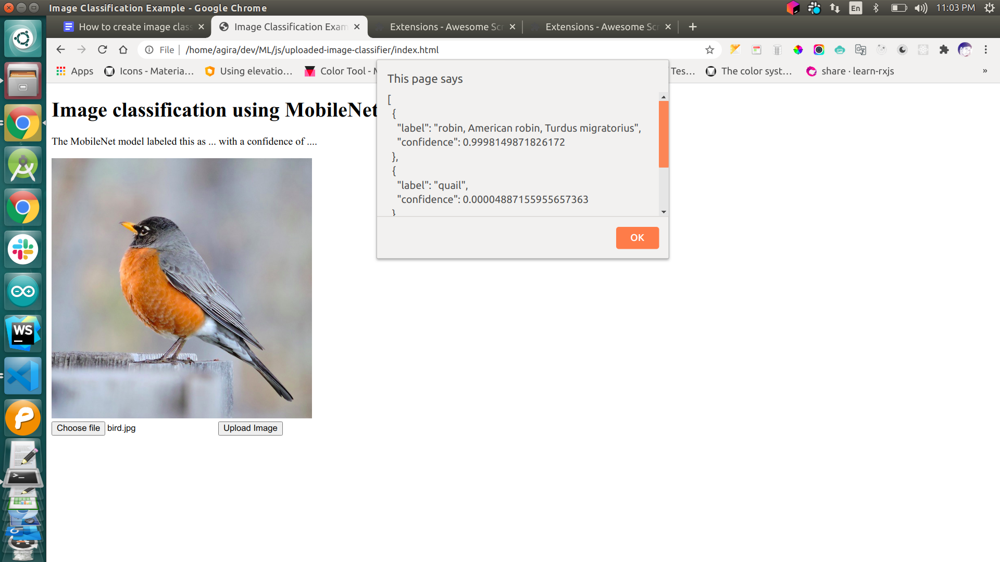

# object-detector-in-js
Object detector while uploading in javascript using ml5js and mobilenet.

# Code Explantion
We are loading the ml5.js library source code in our index. html file for access to the ml5js APIs (machine learning functionalities.

Load your image classification model by using the  “ml5.imageClassifier('MobileNet', modelLoaded);”  modelLoaded is the function definition which is used to know whether the model was loaded or not. Here we use 'MobileNet’. This is the pretrained model. That is able to categories or detect the 1000 of objects. If you want to detect new one you need to create your 
Own model.

The following link for mobilenet image categories.
 https://github.com/tensorflow/tfjs-models/blob/master/mobilenet/src/imagenet_classes.ts

Bind the detectImage function to upload file input onchange events. So When the image was uploaded the detectImage function will call and there our classify method will detect the image.

After it will call our getResult function then we can get the detected image result.

